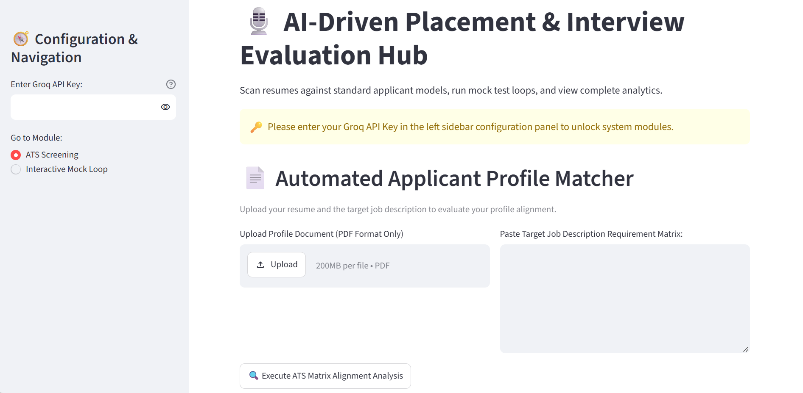
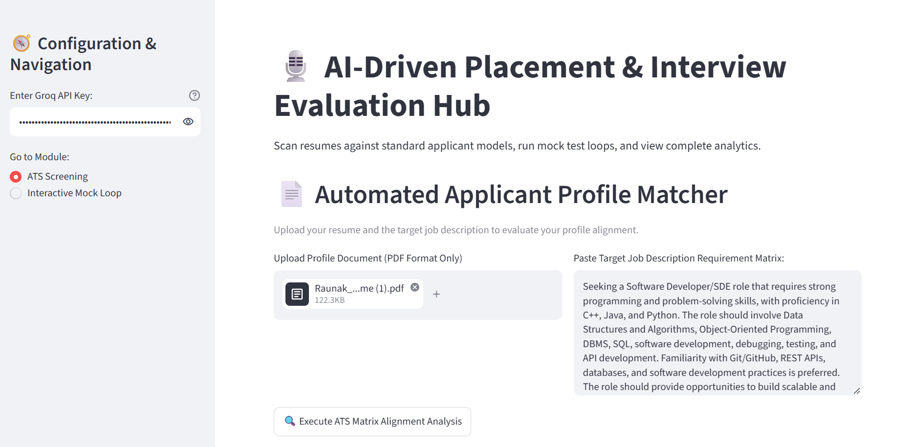
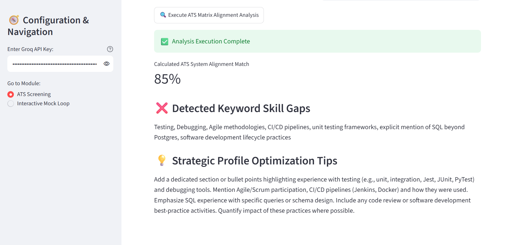
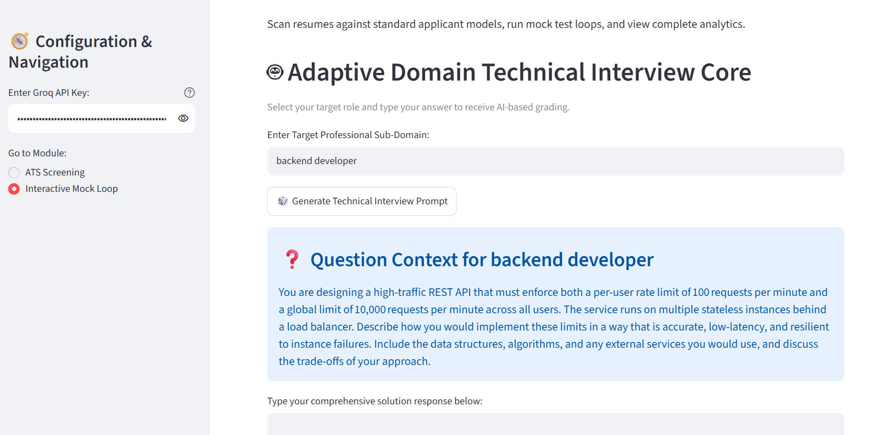
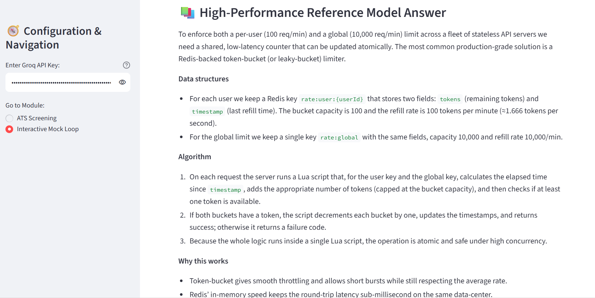
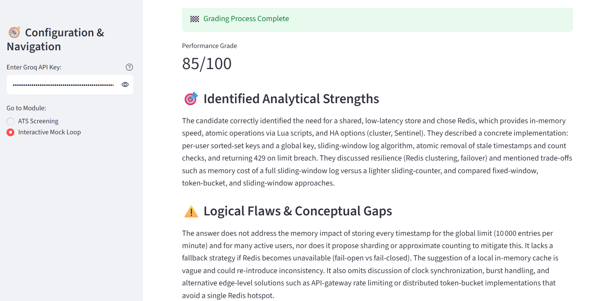

# AI Placement Evaluator

## Objective
Develop an AI-powered Placement Evaluator that simulates real-world technical interviews through dynamic question generation, real-time response analysis, and structured career feedback.

## Features
- Domain-Agnostic Interview Engine
- Dynamic Question Generation
- Real-Time Response Analysis
- Structured Candidate Feedback
- Secure API Key Management
- Persistent Conversation Context

## Tech Stack
- Python 3.10+
- Streamlit
- Groq Cloud API / OpenAI API
- REST API Integration
- Pydantic
- JSON Schema

## Project Architecture
User → Streamlit UI → LLM API → Evaluation Engine → Feedback Report
 
## Screenshots
### Home Screen
Shows the main application dashboard with ATS Screening and Interactive Mock Interview modules.
 


### ATS Screening Input
Upload a resume and provide a job description for profile matching analysis.
 


### ATS Analysis Report
AI-generated ATS compatibility report highlighting profile alignment and skill gaps.
 

 
### Technical Interview Question Generation
Domain-specific technical interview questions generated dynamically based on the selected role.
 


### Reference Model Answer
AI-generated high-performance reference solution used as the evaluation benchmark.



### Candidate Performance Report
Comprehensive feedback report including performance score, strengths, conceptual gaps, and improvement recommendations.


 
## Installation

```bash
git clone https://github.com/your-username/AI-Placement-Evaluator.git
cd AI-Placement-Evaluator
pip install -r requirements.txt
streamlit run app.py
